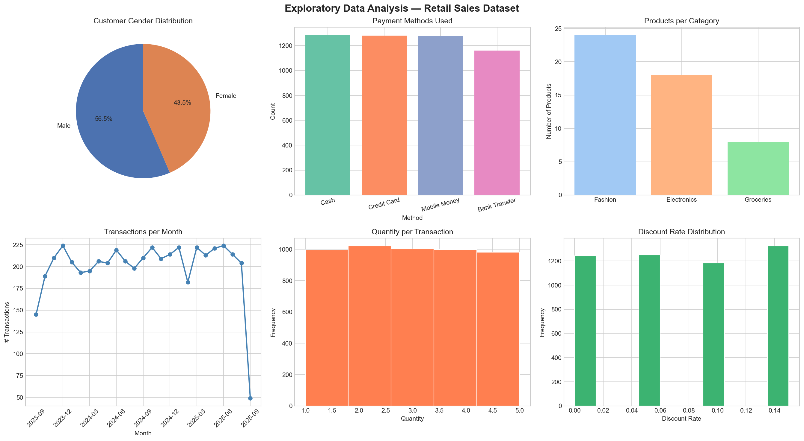
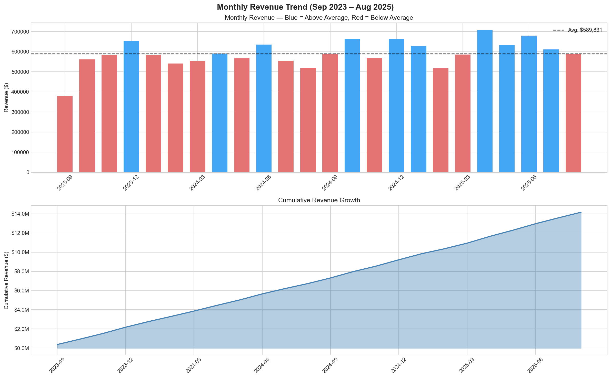
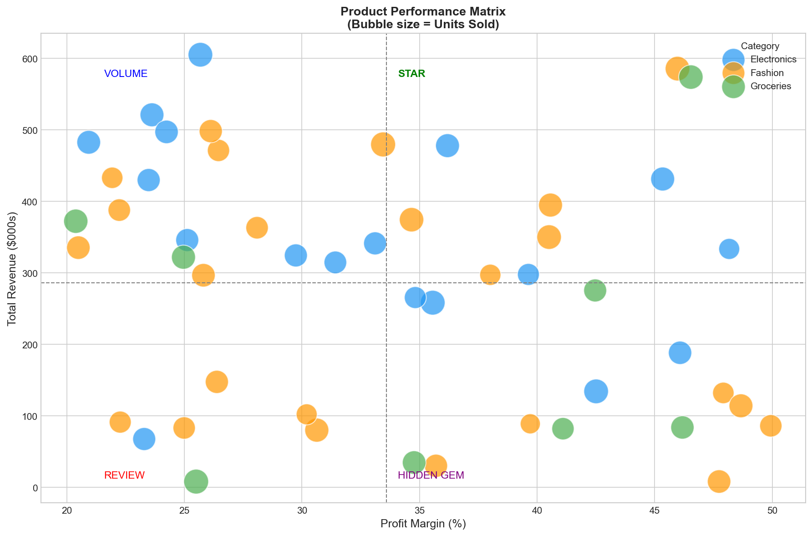
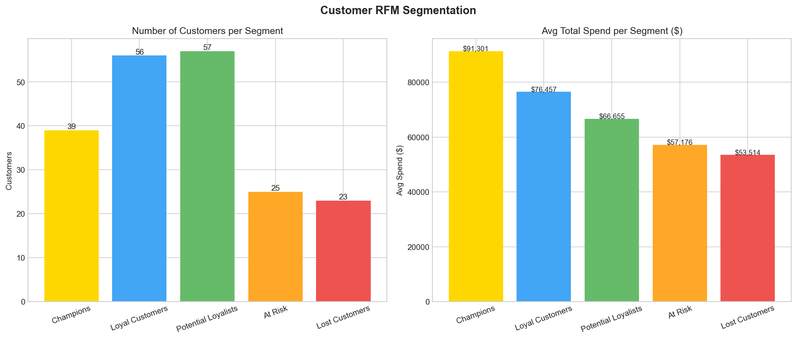
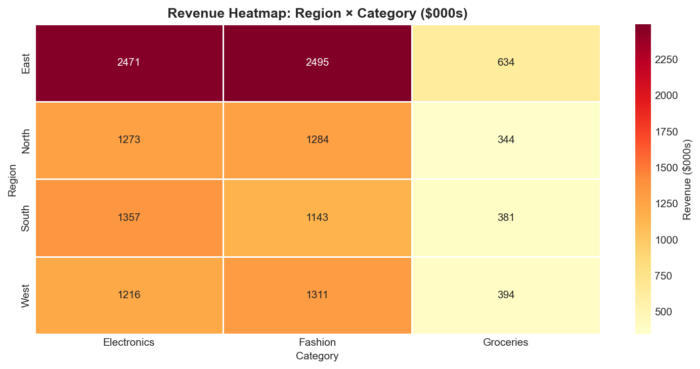
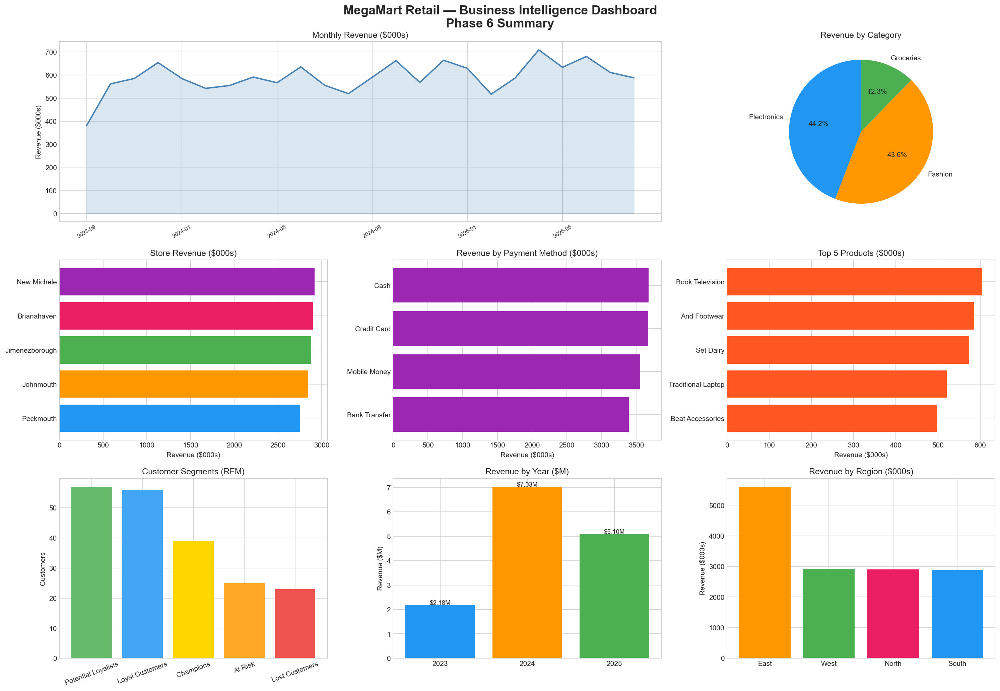

# 🛒 Retail Sales Business Database & Insights

> Design and develop a structured business database and generate insights from it to support decision-making.

---

## 📌 Project Overview

This project builds a fully relational retail sales database using **Microsoft SQL Server**, powered by a real-world dataset sourced from Kaggle. It covers the complete data pipeline — from raw data ingestion and cleaning, through relational schema design, SQL querying, trend analysis, and finally business decision support with visualizations.

**Dataset:** [Retail Sales Dataset — Kaggle (Buhari Shehu)](https://www.kaggle.com/datasets/buharishehu/retail-sales-dataset)

---

## 🗂️ Repository Structure

```
retail-sales-business-database/
│
├── data/
│   ├── retail_sales_dataset.xlsx          ← Raw dataset (4 sheets)
│   └── cleaned_data/
│       ├── customers_clean.csv
│       ├── products_clean.csv
│       ├── stores_clean.csv
│       └── transactions_clean.csv
│
├── notebooks/
│   ├── retail_sales_preprocessing.ipynb   ← Cleaning & EDA
│   └── insights.ipynb              ← Visualizations & insights
│
├── sql/
│   ├── 01_create_tables.sql               ← Schema DDL
│   ├── 02_import_data.sql                 ← Bulk CSV import
│   ├── 03_queries_and_insights.sql        ← All analytical queries
│   └── 04_summary_and_trends.sql   ← Summaries & decisions
│
├── charts/
│   ├── eda_overview.png
│   ├── ER diagram.png
│   ├── revenue_trend.png
│   ├── yearly_comparison.png
│   ├── seasonal_pattern.png
│   ├── category_summary.png
│   ├── product_matrix.png
│   ├── top_bottom_products.png
│   ├── rfm_segments.png
│   ├── customer_retention.png
│   ├── age_gender_revenue.png
│   ├── store_performance.png
│   ├── region_category_heatmap.png
│   ├── discount_analysis.png
│   └── business_dashboard.png
│
│── Project Report.pdf
│
└── README.md
```

---

## 🗄️ Database Schema

The database **RetailSalesDataBase** consists of 4 relational tables:

| Table | Rows | Description |
|---|---|---|
| `Customers` | 200 | Customer demographics — ID, name, gender, age, city, join date |
| `Products` | 50 | Product catalog — ID, name, category, subcategory, unit price, cost price, profit margin |
| `Stores` | 5 | Branch locations — ID, store name, city, region |
| `Transactions` | 5,000 | Sales fact table — date, customer, product, store, quantity, discount, payment method, total amount |

### Entity-Relationship Diagram

```
┌─────────────┐         ┌──────────────┐
│  Customers  │         │   Products   │
│─────────────│         │──────────────│
│ PK CustomerID│        │ PK ProductID │
│   FullName  │         │   Category   │
│   Gender    │         │   UnitPrice  │
│   Age       │         │   CostPrice  │
│   City      │         │ ProfitMargin │
│   JoinDate  │         └──────┬───────┘
└──────┬──────┘                │
       │                       │
       └──────────┬────────────┘
                  ▼
     ┌────────────────────────┐
     │      Transactions      │
     │────────────────────────│
     │ PK TransactionID       │
     │ FK CustomerID          │
     │ FK ProductID           │
     │ FK StoreID             │
     │    Date                │
     │    Quantity            │
     │    Discount            │
     │    PaymentMethod       │
     │    TotalAmount         │
     └───────────┬────────────┘
                 │
        ┌────────┘
        ▼
  ┌────────────┐
  │   Stores   │
  │────────────│
  │ PK StoreID │
  │  StoreName │
  │  City      │
  │  Region    │
  └────────────┘
```

---

## ⚙️ Tech Stack

| Tool | Purpose |
|---|---|
| Python 3 / Jupyter Notebook | Data cleaning, preprocessing, visualizations |
| Pandas, NumPy | Data manipulation |
| Matplotlib, Seaborn | Charts and graphs |
| Microsoft SQL Server | Relational database storage |
| SQL Server Management Studio (SSMS) | Query execution and database management |

---

## 🚀 How to Run

### Step 1 — Data Cleaning (Jupyter Notebook)
```bash
# Install dependencies
pip install pandas numpy matplotlib seaborn openpyxl

# Open notebook
jupyter notebook notebooks/retail_sales_preprocessing.ipynb
```
Run all cells in order. This produces cleaned CSVs in `data/cleaned_data/`.

### Step 2 — Database Setup (SSMS)
```sql
-- 1. Create the database
CREATE DATABASE RetailSalesDataBase;

-- 2. Run schema script
-- Open sql/01_create_tables.sql in SSMS → F5

-- 3. Import data (update file paths first)
-- Open sql/02_import_data.sql in SSMS → F5
```
> **Import order:** Stores → Products → Customers → Transactions (respects foreign keys)

### Step 3 — Run Queries (SSMS)
```
Open sql/03_queries_and_insights.sql → Select any query → F5
Open sql/04_phase6_summary_and_trends.sql → Select any section → F5
```

### Step 4 — Visualizations (Jupyter Notebook)
```bash
jupyter notebook notebooks/insights.ipynb
```

---

## 📊 Key Results

### Business KPIs

| Metric | Value |
|---|---|
| Total Revenue | $14,301,903 |
| Total Transactions | 5,000 |
| Unique Customers | 200 |
| Avg Transaction Value | $2,860 |
| Avg Profit Margin | 33.6% |
| Date Range | Sep 2023 – Sep 2025 |

### Revenue by Category

| Category | Revenue | Share |
|---|---|---|
| Electronics | $6,316,917 | 44.2% |
| Fashion | $6,232,279 | 43.6% |
| Groceries | $1,752,705 | 12.3% |

### Top Store Performance

| Store | Region | Revenue |
|---|---|---|
| MegaMart New Michele | West | $2,920,407 |
| MegaMart Brianahaven | North | $2,900,701 |
| MegaMart Jimenezborough | South | $2,880,114 |
| MegaMart Johnmouth | East | $2,847,047 |
| MegaMart Peckmouth | East | $2,753,632 |

---

## 📈 EDA Overview



---

## 📉 Revenue Trend



---

## 🏆 Product Performance Matrix



---

## 👥 Customer RFM Segments



---

## 🗺️ Region × Category Heatmap



---

## 📋 Business Dashboard



---

## 🔍 Key Findings

**Trends Identified:**
- Q2 (April–June) is the peak season every year — April 2025 was the single best month at **$708,233**
- Revenue grew from $2.18M (partial 2023) → **$7.03M** (full year 2024)
- East region generates **39% of all revenue** with only 2 stores — highest demand density
- Discounts do **not** increase spending — no-discount transactions have the highest average value ($3,094)

**Gaps Identified:**
- Groceries underperforms at only **12.3% revenue share** despite having 4 subcategories
- MegaMart Peckmouth consistently trails all other stores in revenue
- Several high-margin products (>40% margin) have very low sales volumes — untapped potential

**Top Business Recommendations:**
1. **Expand East region** — open a 3rd store to meet high customer demand
2. **Promote Hidden Gem products** — high-margin, low-sales items need targeted campaigns before discounting
3. **Re-engage at-risk customers** — customers inactive for 181–365 days need a loyalty campaign
4. **Plan for Q2 peak** — stock up inventory and launch marketing campaigns before April each year
5. **Investigate MegaMart Peckmouth** — identify root cause of consistent underperformance

---

## 📄 SQL Views Created

| View | Purpose |
|---|---|
| `vw_TransactionDetails` | Full joined view of all 4 tables — ready for Power BI |
| `vw_MonthlySummary` | Monthly aggregated sales summary |
| `vw_CustomerSummary` | RFM base — recency, frequency, monetary per customer |

---

## 👤 Author

**Nisansala Ruwan Pathirana**
Data Science Intern.

---

## 📜 License

This project is for educational and internship purposes.
Dataset sourced from [Kaggle](https://www.kaggle.com/datasets/buharishehu/retail-sales-dataset) — original license applies.
